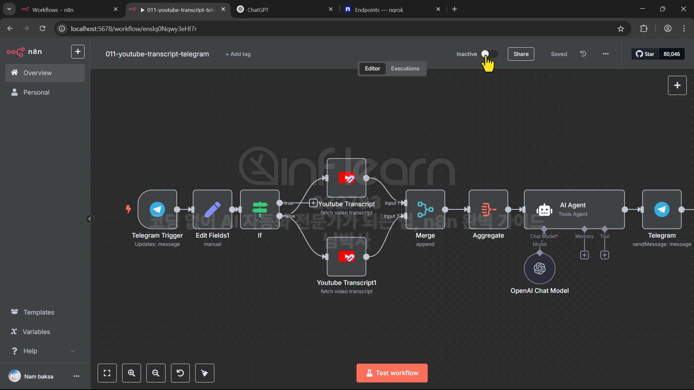
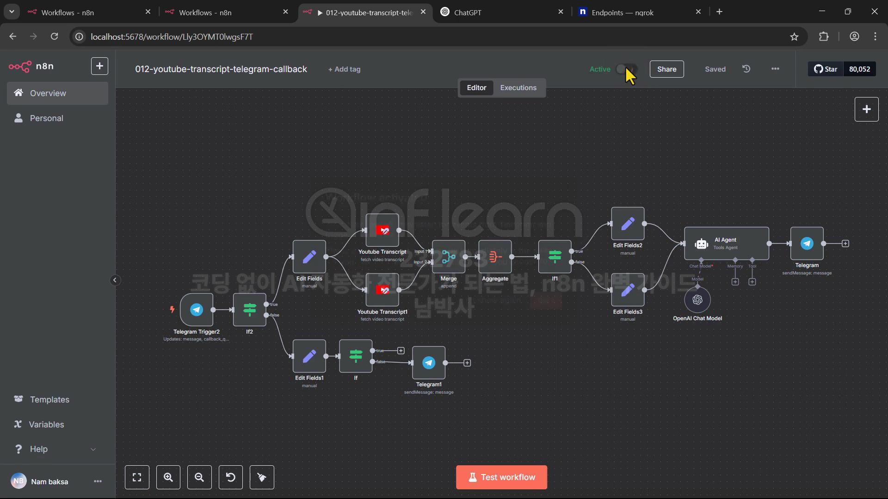

# 코딩 없이 AI 자동화 전문가가 되는 법, n8n 완벽 가이드 - 1

## 섹션 1. AI Agent N8N

### 1. AI Agent에 대한 이해와 각종 Tool에 대해 알아보기

AI Agent 만드는 법

1. 코딩
2. n8n, Make, Zapier, 등

대부분 API 사용료가 필요함. 특히 AI API 사용료.

n8n 선택 이유

- Make 는 확장성이 가장 낮음. 코딩을 아예 안한다고 하면 고려해볼 수 있음.
- n8n 은 완전 무료(셀프 호스팅)이 있음.
- Zapier 가 가장 오래 서비스함. 많은 앱을 지원함.
- API 요청이 지원가능하냐가 중요한데 Zapier 는 일부 지원이라 별로.
- 커스텀 코드 지원에 대해 n8n 은 JS, Python 지원

### 2. 완전 초보를 위한 N8N 설치부터 셀프호스팅까지 – Docker 실습편

GPU 메모리 8기가 이상이면 GPU 사용으로 설치할 수 있음.

postgresql은 기본은 n8n 만 내부적으로 사용하도록 설정되어 있음.

> 공통적으로 사용할 필요가 있으면 비밀번호 설정 등 추가 설정

기본은 https 만 접속 가능. http 접속하려면 환경 변수 추가.

> N8N_SECURE_COOKIE=false -> docker compose 에 추가할 수 있음

## 섹션 2. 채팅 AI Agent 만들기

### 3. N8N 기본 인터페이스와 채팅 AI Agent 생성해보기

워크플로우로 보통 프로그램을 만듬

### 4. 채팅 Agent에 메모리 노드와 SerpAPI 툴을 사용해 검색 능력 부여하기

AI Agent 에 메모리를 연결하지 않으면 대화 컨텍스트를 모른다.

AI Agent 에 Tool 을 연결하면 추가적인 능력을 부여할 수 있다.

> 검색을 하거나, ... 등등


### 5. AI Agent에 직접 Google API 를 사용해서 구글 검색 툴 작성하기

HTTP Request Tool 을 사용할 때 이름과 Description 의 설명을 보고 ai 가 사용하기 때문에 잘 작성하는 것이 중요하다.


### 6. 네이버 검색 API 를 추가하고 검색 기능을 서브 워크플로우로 작성하기

네이버 검색과 구글 검색을 둘다 붙여서 워크플로우를 작성할 수 있다.

프롬프트를 통해서 두 툴을 사용하도록 할 수 있지만, 검색 워크플로우를 분리해서(HttpRequest 툴이 아니라 노드 사용) 두 검색을 둘 다 사용하도록 만들 수 있다.

> Call n8n Workflow Tool

다른 워크플로우 노드에서 넘어온 값은 json으로 넘어오는데 이는 분리한 워크플로우에서 각 노드들이 받을 수 있도록 입력 값을 expression 를 통해서 넣어줘야 한다.

워크플로우를 active 시키고 트리거를 접속할 수 있도록 public 으로 할 수 있다.


## 섹션 3. 이메일 AI Agent

### 7. AI로 네이버 스팸 메일 자동 분류하기: 이메일 에이전트 완전 자동화 실습

MailBox Name 이 INBOX 이면 기본 메일 함을 의미 -> 모든 메일을 감지.

> 특정 폴더의 메일만 관리하려면 MailBox Name 을 그 이름으로 설정하면 됨. 메일에서 기본적으로 쓰는 이름들이 있음. INBOX, Junk, Deleted Messages, 등

community nodes 에서 필요한 노드를 설치해서 사용할 수 있다.


### 8. Gmail 연동부터 자동 응답까지: 이메일 AI 에이전트 완전 구축법

네이버와 지메일 둘다에서 메일을 가져오고, 이 둘은 포멧이 다르기 때문에 값을 하나의 형태로 맞추기 위해서 Edit Fields 노드를 사용할 수 있다.


### 9. 메일 한 통이면 끝! 구글 캘린더와 연동된 미팅 자동화 에이전트 만들기


### 10. 주소록 기반 자동 미팅 응답 시스템 만들기: 구글 API와 AI 에이전트의 결합

구글 주소록에 등록된 사람에게만 회신할 수 있도록 플로우 수정


## 섹션 4. 요약 AI Agent

### 11. 매일 아침 요약 뉴스, AI가 대신 전해드립니다: N8N + 텔레그램 자동화

여러 뉴스를 각각 요약하기 때문에 요약을 위해 ai가 n번 실행된다.


### 12. <추가> youtube-transcript 오류를 위한 무료 API 분석부터 직접 서버 구축까지!


파이썬 코드를 통해 api 서버를 열고 도커를 통해 배포하여 해당 api 를 사용할 수 있다.

> `http://host.docker.internal:{port}`


```yml
version: '3'

services:
 youtube-transcript:
   build:
     context: .
     dockerfile: Dockerfile
     no_cache: true
   container_name: youtube-transcript-api
   ports:
     - "9012:9012"
   volumes:
     - .:/app
   restart: unless-stopped
   # 로그 제한 설정
   logging:
     options:
       max-size: "10m"
       max-file: "3"
```

### 13. 유튜브 영상 요약봇 만들기: 자막 추출부터 AI 요약까지 노코드 자동화

`apify`: 다양한 api 를 비용을 내고 사용할 수 있는 곳

유튜브 자막 추출이 설정된 언어(영어냐, 한글이냐)와 맞지 않으면 오류가 발생한다.

> 영어, 한글을 추출 노드를 모두 연결해두고 on Error 설정을 continue로 설정하면 동작하도록 할 수 있다.

텍스트 입력으로 받은 유튜브 동영상을 사용하기 때문에 url 을 정규표현식으로 검증하는 것을 `Edit Fields` 에 추가할 수 있다.


### 14. HTTPS 없이 텔레그램 봇 자동화하기: ngrok으로 웹훅 열기 & 자동화 스크립트 구현

`ngrok` 을 통해서 홈 호스팅 환경에서 url 을 열어줄 수 있다.(공유기 포트포워딩 등의 과정 없이) -> 이 주소를 통해 웹훅 사용 가능.

### 15. 유튜브 요약 챗봇 만들기: 텔레그램 인터랙션과 n8n으로 구현하는 AI 자동화



웹훅 등으로 넘겨받은 텍스트 입력에서 _ 등이 없어질 수 있다 -> 입력을 html 로 받는 등의 방법을 사용해볼 수 있다

텔레그램에 버튼을 만들어 요약하거나 번역하거나로 만들 수 있다.



## 섹션 7.  RAG AI Agent

### 24. N8N으로 구현하는 나만의 RAG 시스템: 벡터 검색부터 AI 응답까지

RAG(Retrieval-Argumented Generation, 검색 기반 생성)

- AI가 처음 나왔을 때 토큰 제한이 적었기 때문에 내용을 잘게 쪼개서 전달 했었음
- 랭체인 등을 사용해서 구현하곤 했음
- 회사 내규 데이터 전달해서 답변하도록 하는 등
- 벡터화 필요(임베딩)


### 25. N8N으로 뉴스 요약 AI 만들기: 벡터 DB + 웹검색 통합 RAG 시스템 구현법

새로운 뉴스 피드를 계속 가져오게 될 텐데, 뉴스가 새로운 것인지 알기 위해 redis 에 뉴스 데이터 저장


### 26. 유튜브 자막으로 AI에게 질문하자: N8N + Pinecone으로 RAG 만들기


## 섹션 9. 공공API 활용 Agent 구현하기

### 31. 공공데이터 API 를 사용하여 자동화하는 부동산 갭 투자 분석 시스템 만들기

여기서는 xml -> json 변환을 gpt 를 통해 한다. 직접 구현하면 작업이 크기 때문


### 32. 주소만으로 끝내는 아파트 투자 리포트 자동화: 인구통계 + 위치정보까지 완성


### 33. 실거래가 데이터를 자동 분석해 차트로 보여주는 AI 리포트 만들기


## 섹션 10. 추가 강좌

### 34. 내 컴퓨터에서 직접 AI 돌리기: Ollama로 LLM 모델 구동하기

ollama 를 연결해서 로컬 혹은 내부에서 모델을 돌릴 수 있다. 파인튜닝도 된다.

### 36. 도커 n8n 안전 업데이트 가이드: 실전 명령어와 주의사항까지

업데이트 필요 시 n8n 의 좌측 밑에 업데이트 표시가 표출된다.

무조건 업데이트 하는 것 보다 릴리즈 노트를 보고 어떤 기능이 추가되었는지, 수정되었는지 확인하고 필요한 경우 업데이트 하는 것이 좋다.

n8n 설치 docker compose 에 기본적으로 이미지를 latest 를 사용하고 있음

업데이트 순서

- `docker compose pull` 업데이트된 이미지 다운로드
- `docker compose down` 기존 컨테이너 제거
- `docker compose up -d` 필요에 따라 `--profile gpu-nvidia`, `--profile gpu-amd`, `--profile cpu`
