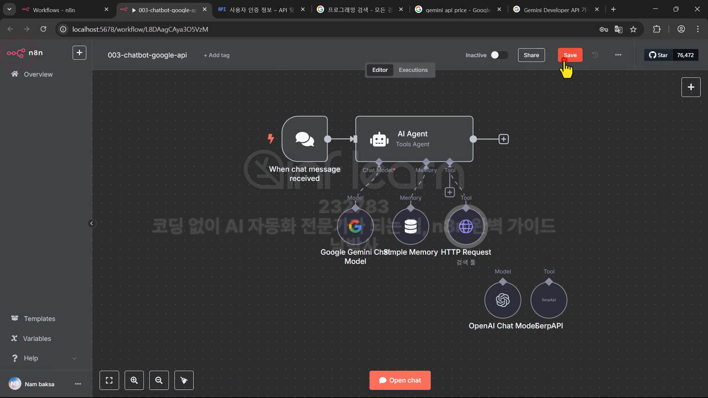

# 코딩 없이 AI 자동화 전문가가 되는 법, n8n 완벽 가이드 - 1

## 섹션 1. AI Agent N8N

### 1. AI Agent에 대한 이해와 각종 Tool에 대해 알아보기

AI Agent 만드는 법

1. 코딩
2. n8n, Make, Zapier, 등

대부분 API 사용료가 필요함. 특히 AI API 사용료.

n8n 선택 이유

- Make 는 확장성이 가장 낮음. 코딩을 아예 안한다고 하면 고려해볼 수 있음.
- n8n 은 완전 무료(셀프 호스팅)이 있음.
- Zapier 가 가장 오래 서비스함. 많은 앱을 지원함.
- API 요청이 지원가능하냐가 중요한데 Zapier 는 일부 지원이라 별로.
- 커스텀 코드 지원에 대해 n8n 은 JS, Python 지원

### 2. 완전 초보를 위한 N8N 설치부터 셀프호스팅까지 – Docker 실습편

GPU 메모리 4기가 이상이면 GPU 사용으로 설치할 수 있음.

postgresql은 기본은 n8n 만 내부적으로 사용하도록 설정되어 있음.

> 공통적으로 사용할 필요가 있으면 비밀번호 설정 등 추가 설정

기본은 https 만 접속 가능. http 접속하려면 환경 변수 추가.

> N8N_SECURE_COOKIE=false -> docker compose 에 추가할 수 있음

## 섹션 2. 채팅 AI Agent 만들기

### 3. N8N 기본 인터페이스와 채팅 AI Agent 생성해보기

워크플로우로 보통 프로그램을 만듬

### 4. 채팅 Agent에 메모리 노드와 SerpAPI 툴을 사용해 검색 능력 부여하기

AI Agent 에 메모리를 연결하지 않으면 대화 컨텍스트를 모른다.

AI Agent 에 Tool 을 연결하면 추가적인 능력을 부여할 수 있다.

> 검색을 하거나, ... 등등

### 5. AI Agent에 직접 Google API 를 사용해서 구글 검색 툴 작성하기

HTTP Request Tool 을 사용할 때 이름과 Description 의 설명을 보고 ai 가 사용하기 때문에 잘 작성하는 것이 중요하다.

### 6. 네이버 검색 API 를 추가하고 검색 기능을 서브 워크플로우로 작성하기

네이버 검색과 구글 검색을 둘다 붙여서 워크플로우를 작성할 수 있다.

프롬프트를 통해서 두 툴을 사용하도록 할 수 있지만, 검색 워크플로우를 분리해서(HttpRequest 툴이 아니라 노드 사용) 두 검색을 둘 다 사용하도록 만들 수 있다.

> Call n8n Workflow Tool

다른 워크플로우 노드에서 넘어온 값은 json으로 넘어오는데 이는 분리한 워크플로우에서 각 노드들이 받을 수 있도록 입력 값을 expression 를 통해서 넣어줘야 한다.

워크플로우를 active 시키고 트리거를 접속할 수 있도록 public 으로 할 수 있다.

### 7. AI로 네이버 스팸 메일 자동 분류하기: 이메일 에이전트 완전 자동화 실습

MailBox Name 이 INBOX 이면 기본 메일 함을 의미 -> 모든 메일을 감지.

> 특정 폴더의 메일만 관리하려면 MailBox Name 을 그 이름으로 설정하면 됨. 메일에서 기본적으로 쓰는 이름들이 있음. INBOX, Junk, Deleted Messages, 등

community nodes 에서 필요한 노드를 설치해서 사용할 수 있다.

### 8. Gmail 연동부터 자동 응답까지: 이메일 AI 에이전트 완전 구축법

네이버와 지메일 둘다에서 메일을 가져오고, 이 둘은 포멧이 다르기 때문에 값을 하나의 형태로 맞추기 위해서 Edit Fields 노드를 사용할 수 있다.

### 9. 메일 한 통이면 끝! 구글 캘린더와 연동된 미팅 자동화 에이전트 만들기

### 10. 주소록 기반 자동 미팅 응답 시스템 만들기: 구글 API와 AI 에이전트의 결합

구글 주소록에 등록된 사람에게만 회신할 수 있도록 플로우 수정

