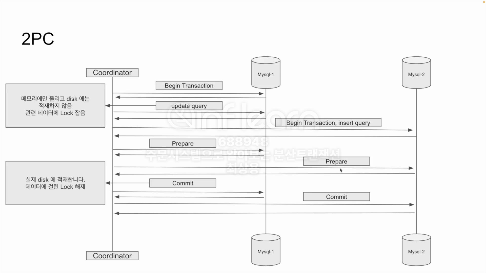
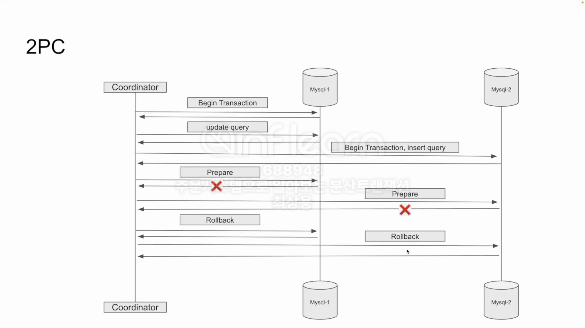
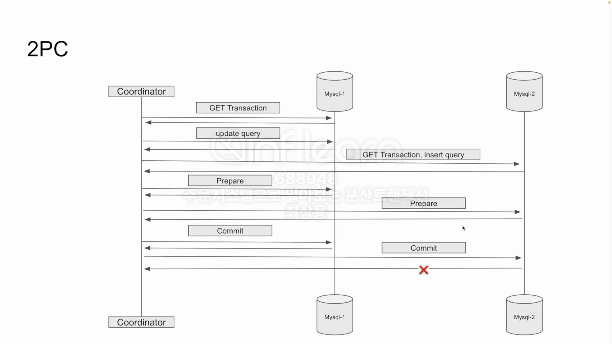

# 주문시스템으로 알아보는 분산트랜잭션

## 4. 요구사항 정의

- 주문 데이터를 저장하여야 한다.
- 재고관리를 하여야 한다.
- 포인트를 사용해야 한다.
- 주문, 재고, 포인트 데이터의 정합성이 맞아야 한다.
- 동일한 주문은 1번만 이루어져야 한다.

## 9. 동일한 주문 식별

## 10. Lock을 활용하여 주문로직이 1번만 수행되도록 변경하기

## 12. MSA 에서 발생할 수 있는 문제점

서비스 간 데이터 정합성을 보장하기가 까다로워짐

- 독립적으로 분리된 서비스는 별도의 데이터베이스를 갖게 됨
- 각 서비스의 데이터베이스는 서로 다른 트랜잭션 범위를 가짐

분산 트랜잭션을 보장하기 위한 방법들

- 2PC
- TCC
- SAGA

## 13. 2PC 란 무엇인가?

- Two-Phase Commit Protocol 의 약자로 분산 시스템에서 트랜잭션의 원자성을 보장하기 위해 사용하는 프로토콜
- 트랜잭션을 두 단계로 나누어 처리
  - Prepare 단계: 트랜잭션 매니저가 참여자에게 작업 준비가 가능한지 묻는다.
  - Commit 단계: Prepare 단계에서 모든 참여자가 작업이 가능하다고 응답하면 실제로 커밋을 수행한다.
- 대표적인 구현으로는 XA 트랜잭션이 존재

- 이상적으로는 위와같이 동작하지만 실 서비스에서는 다양한 예외 상황이 존재

- 트랜잭션을 얻어오고 쿼리 수행을 모두 했지만 커밋할 준비가 되었는지 물어보는 prepare 단계에서 실패할 수 있음

- 더 큰 문제는 prepare 단계까지 모두 수행되고 commit 단계에서 실패하는 경우
- 2PC 프로토콜의 원칙상 prepare 단계 이후 참여자는 스스로 롤백을 하면 안되며, 코디네이터의 커밋 또는 롤백 명령을 기다려야함
- 커밋 명령이 일시적으로 실패했다면, 코디네이터는 커밋을 재시도해야 하며, 이는 트랜잭션의 원자성을 유지하기 위한 핵심 절차
- 하지만 2번 MySQL이 알 수 없는 이유로 커밋이 불가능할 경우에는 사람이 수동으로 개입해서 커밋을 하거나 데이터를 조작해주어야 함
- 커밋이 될 때까지 2번 MySQL 서버가 잡고 있는 락이 유지되어 다른 곳에서 접근할 수 없게 됨

장점✅

- 강력한 정합성 보장
- 사용하는 데이터베이스가 XA를 지원한다면 구현난이도가 낮음

단점❌

- 사용하는 데이터베이스가 XA를 지원하지 않는다면 구현하기 어려움
- prepare 단계 이후 commit 이 완료될 때까지 lock을 유지하고 있기 때문에 가용성이 낮아짐
- 장애 복구 시 수동으로 개입하여 해결해야 함
- 실용성이 낮음

실무에서는？

- 2PC 보다는 다른 방법을 사용하여 분산트랜잭션을 구현
