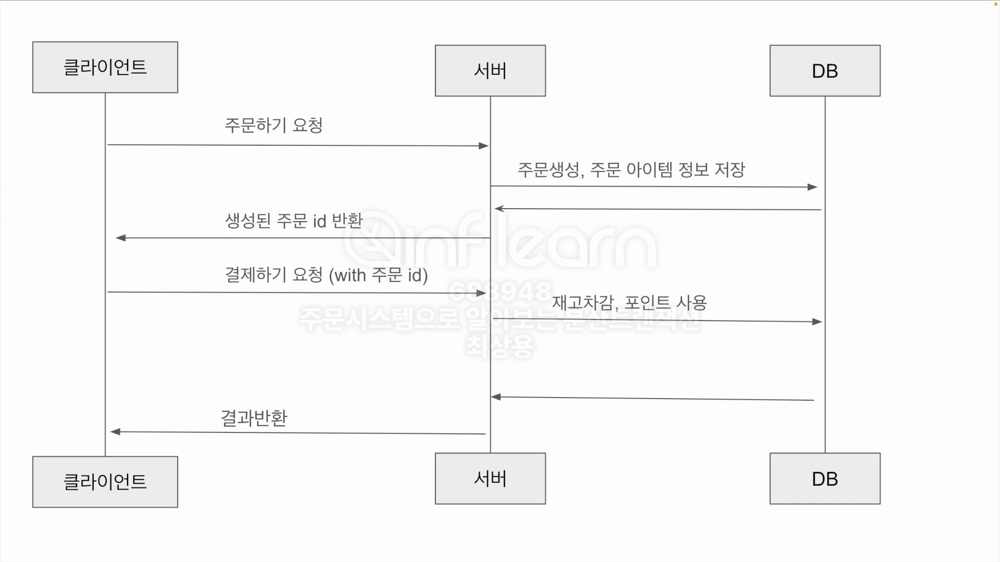
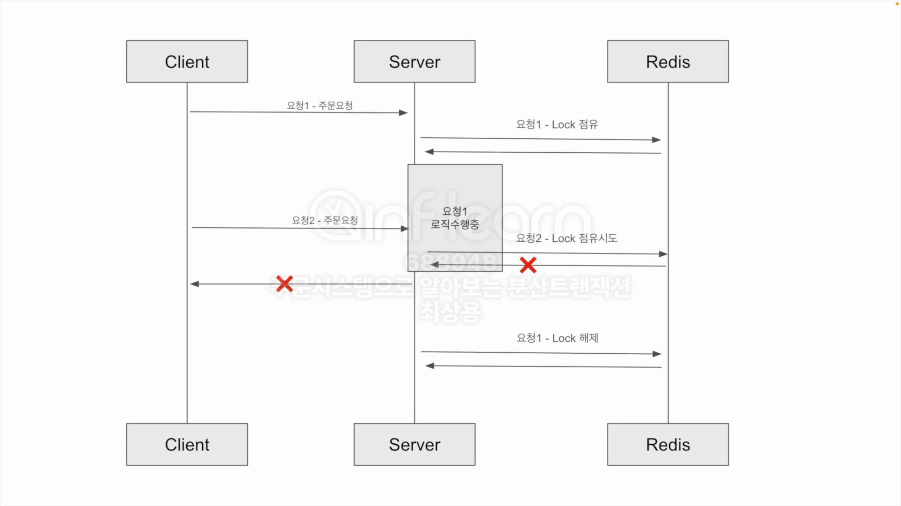

# 주문시스템으로 알아보는 분산트랜잭션

## 4. 요구사항 정의

- 주문 데이터를 저장하여야 한다.
- 재고관리를 하여야 한다.
- 포인트를 사용해야 한다.
- 주문, 재고, 포인트 데이터의 정합성이 맞아야 한다.
- 동일한 주문은 1번만 이루어져야 한다.

## 9. 동일한 주문 식별

## 10. Lock을 활용하여 주문로직이 1번만 수행되도록 변경하기

## 12. MSA 에서 발생할 수 있는 문제점

서비스 간 데이터 정합성을 보장하기가 까다로워짐

- 독립적으로 분리된 서비스는 별도의 데이터베이스를 갖게 됨
- 각 서비스의 데이터베이스는 서로 다른 트랜잭션 범위를 가짐

분산 트랜잭션을 보장하기 위한 방법들

- 2PC
- TCC
- SAGA
