# 주문시스템으로 알아보는 분산트랜잭션

## 4. 요구사항 정의

- 주문 데이터를 저장하여야 한다.
- 재고관리를 하여야 한다.
- 포인트를 사용해야 한다.
- 주문, 재고, 포인트 데이터의 정합성이 맞아야 한다.
- 동일한 주문은 1번만 이루어져야 한다.

## 9. 동일한 주문 식별

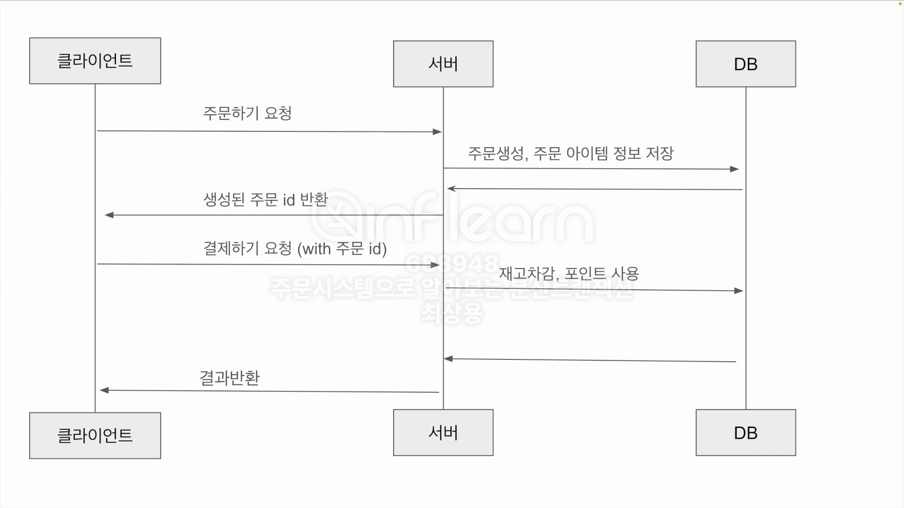

## 10. Lock을 활용하여 주문로직이 1번만 수행되도록 변경하기

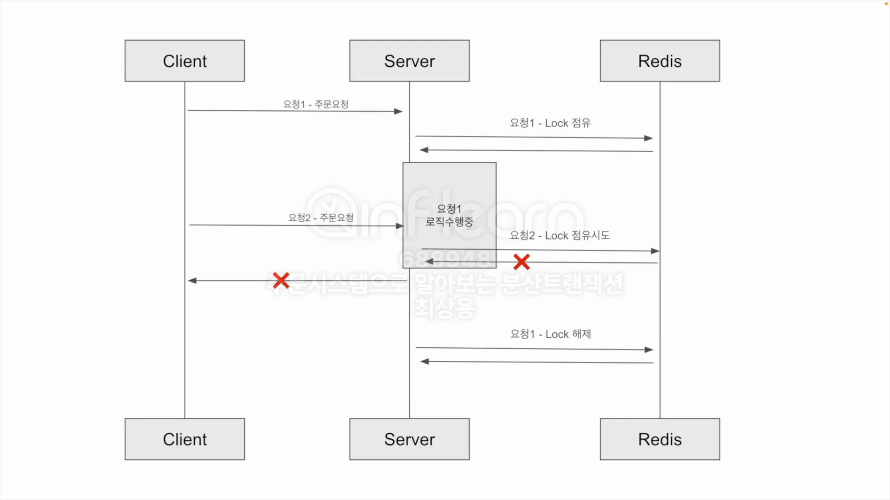

## 12. MSA 에서 발생할 수 있는 문제점

서비스 간 데이터 정합성을 보장하기가 까다로워짐

- 독립적으로 분리된 서비스는 별도의 데이터베이스를 갖게 됨
- 각 서비스의 데이터베이스는 서로 다른 트랜잭션 범위를 가짐

분산 트랜잭션을 보장하기 위한 방법들

- 2PC
- TCC
- SAGA

## 13. 2PC 란 무엇인가?

- Two-Phase Commit Protocol 의 약자로 분산 시스템에서 트랜잭션의 원자성을 보장하기 위해 사용하는 프로토콜
- 트랜잭션을 두 단계로 나누어 처리
  - Prepare 단계: 트랜잭션 매니저가 참여자에게 작업 준비가 가능한지 묻는다.
  - Commit 단계: Prepare 단계에서 모든 참여자가 작업이 가능하다고 응답하면 실제로 커밋을 수행한다.
- 대표적인 구현으로는 XA 트랜잭션이 존재

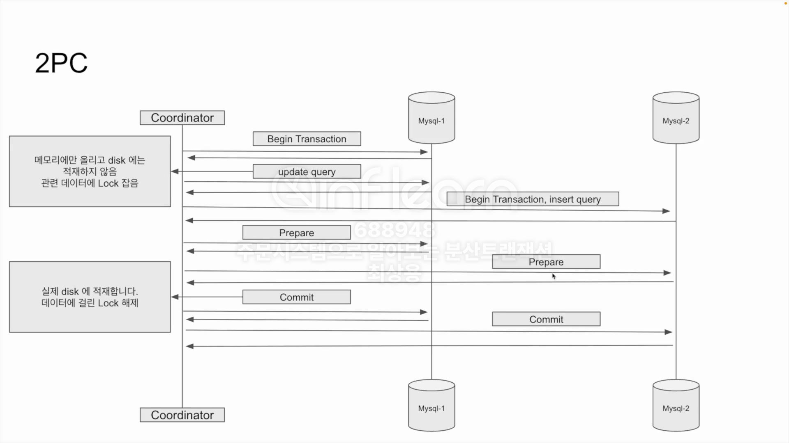

- 이상적으로는 위와같이 동작하지만 실 서비스에서는 다양한 예외 상황이 존재

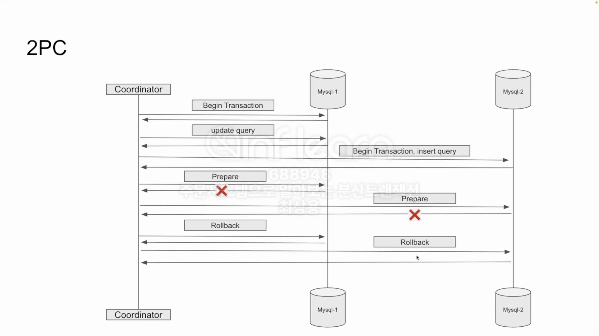

- 트랜잭션을 얻어오고 쿼리 수행을 모두 했지만 커밋할 준비가 되었는지 물어보는 prepare 단계에서 실패할 수 있음

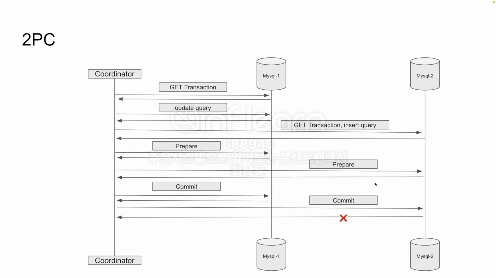

- 더 큰 문제는 prepare 단계까지 모두 수행되고 commit 단계에서 실패하는 경우
- 2PC 프로토콜의 원칙상 prepare 단계 이후 참여자는 스스로 롤백을 하면 안되며, 코디네이터의 커밋 또는 롤백 명령을 기다려야함
- 커밋 명령이 일시적으로 실패했다면, 코디네이터는 커밋을 재시도해야 하며, 이는 트랜잭션의 원자성을 유지하기 위한 핵심 절차
- 하지만 2번 MySQL이 알 수 없는 이유로 커밋이 불가능할 경우에는 사람이 수동으로 개입해서 커밋을 하거나 데이터를 조작해주어야 함
- 커밋이 될 때까지 2번 MySQL 서버가 잡고 있는 락이 유지되어 다른 곳에서 접근할 수 없게 됨

장점✅

- 강력한 정합성 보장
- 사용하는 데이터베이스가 XA를 지원한다면 구현난이도가 낮음

단점❌

- 사용하는 데이터베이스가 XA를 지원하지 않는다면 구현하기 어려움
- prepare 단계 이후 commit 이 완료될 때까지 lock을 유지하고 있기 때문에 가용성이 낮아짐
- 장애 복구 시 수동으로 개입하여 해결해야 함
- 실용성이 낮음

실무에서는？

- 2PC 보다는 다른 방법을 사용하여 분산트랜잭션을 구현

## 14. TCC 란 무엇인가?

TCC 패턴이란?

- TCC(Try-Confirm-Cancel)는 분산 시스템에서 데이터 정합성을 보장하기 위해 사용하는 분산 트랜잭션 처리 방식
- 세 단계로 나누어 트랜잭션을 관리
  - **Try**: 필요한 리소스를 점유할 수 있는지 검사하고 임시로 예약
  - **Confirm**: 실제 리소스를 확정 처리하여 반영
  - **Cancel**: 문제가 생긴 경우, 예약 상태를 취소하여 원복
- Try, Confirm, Cancel 단계는 멱등하게 설계되어야 함

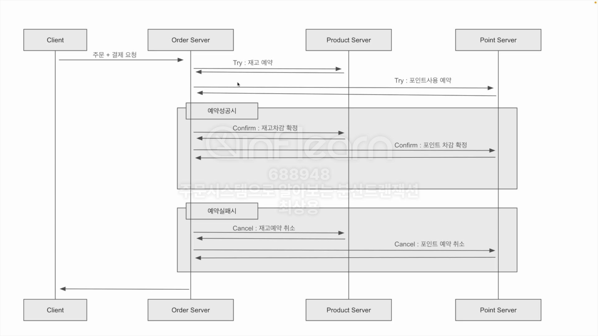

장점✅

- 확장성과 성능에 유리
  - 2PC에 비해 데이터베이스 Lock 점유 시간이 짧음
  - 2PC에 비해 Long Transaction 에 덜 취약
- 장애 복구와 재시도 처리에 유연
  - 비즈니스 정책에 따라 전략을 정할 수 있음

단점❌

- 기존 시스템에 비해 설계와 규현이 복잡
  - 모든 단계(Try, Confirm, Cancel)는 멱등하게 설계되어야 함
  - 네트워크 오류, 재시도 시나리오를 고려한 복잡한 구현이 필요

## 25. TCC 구현하기(10) - Retry 를 활용하여 일시적인 오류에 대처하기

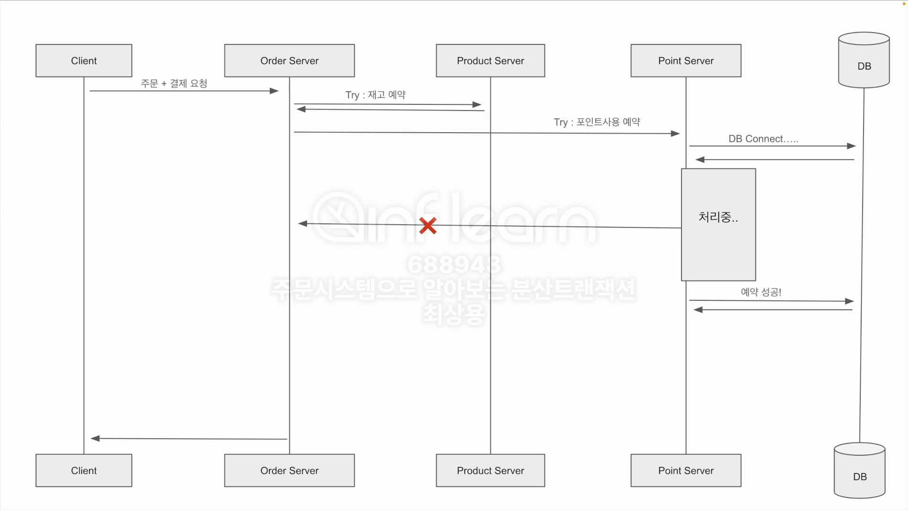

- MSA 환경에서는 네트워크 오류 혹은 일시적 장애가 발생할 수 있기 때문에 이를 고려해야 함
  - 주문 서비스에서 재고 예약까지는 성공적으로 마쳤지만 이어서 포인트를 예약하려는 순간 커넥션풀 부족이나 네트워크 단절 등으로 인해서 포인트 시스템과의 연결을 시도조차 못할 수도 있음
- 타임아웃이 발생할 수 있음
- 재시도 전략은 시스템의 신뢰성을 높이고 불필요한 보상처리 비용을 줄이는데 도움이 될 수 있음
- 재시도 전략을 안전하게 적용하기 위해서는 시스템이 반드시 역동성을 보장하도록 설계되어야 함.

## 26. TCC 구현하기(11) - Pending 상태인 주문 해소 전략

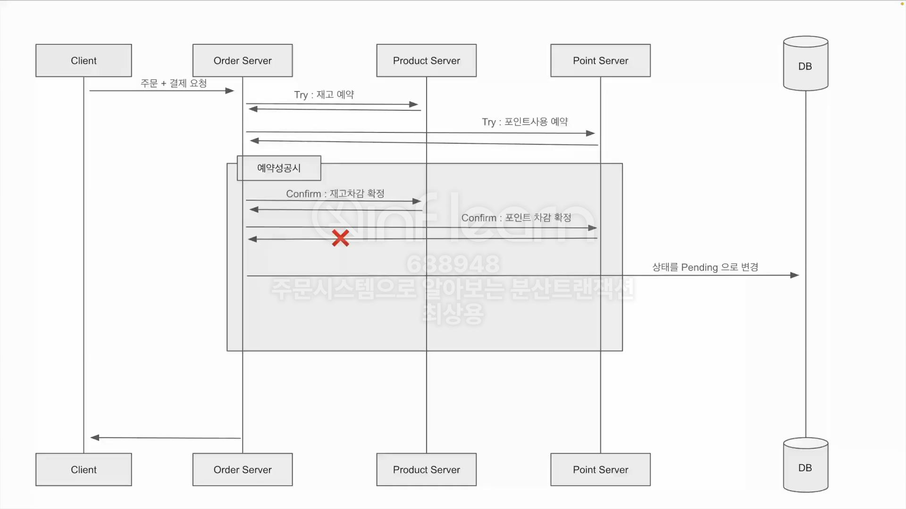

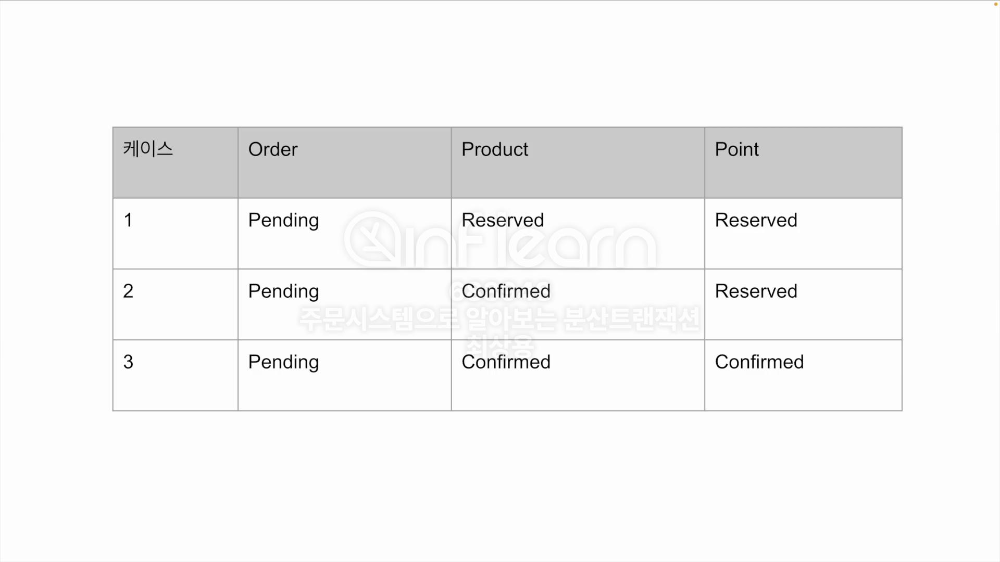

- 주문 도중 오류가 발생해서 상태가 비정상적으로 남아있을 수 있음
  - confirm 단계에서 오류가 발생해서 주문의 상태가 Pending 으로 남아있는 경우
- Pending 상태로 전환된 뒤에 일정 시간이 지난 주문을 강제로 확정처리 하는 방식으로 대응할 수 있음
  - 반드시 이런 방식이 아니라 비즈니스에 맞는 전략을 선택해야 함.

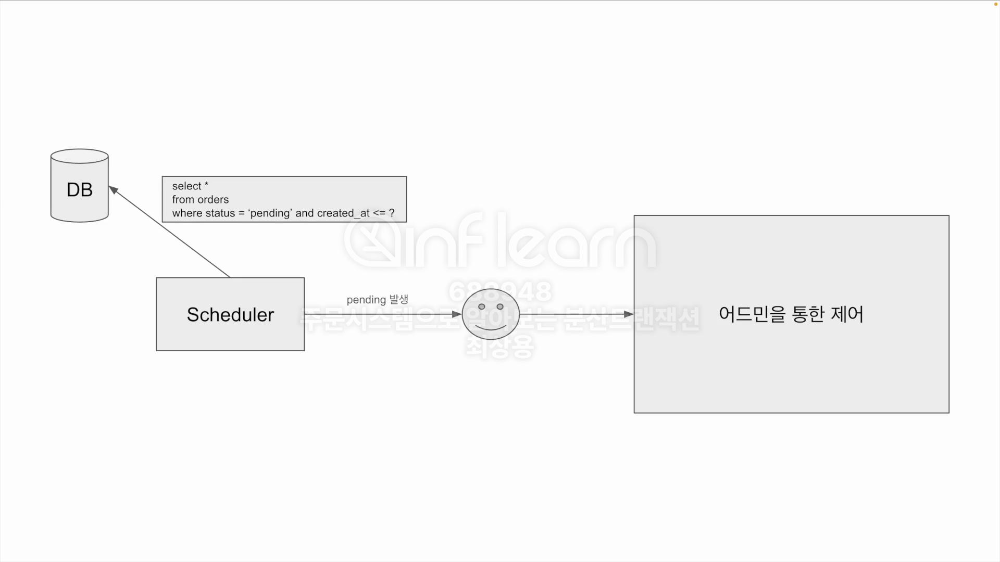

- 좀 더 보편적으로 사용할 수 있는 전략
- Pending 상태로 전환된 지 일전 시간이 지난 주문이 존재할 경우 운영자에게 알림 제공
- 운영자는 어드민 화면에서 각 자원의 상태를 확인한 뒤에 수동으로 확정 또는 취소
- 이 방식은 운영자가 각 상황에 맞는 판단을 내릴 수 있도록 유도할 수 있고 불필요한 중복 주문이나 잘못된 상태 전이로 인한 정합성 문제를 최소화 할 수 있음

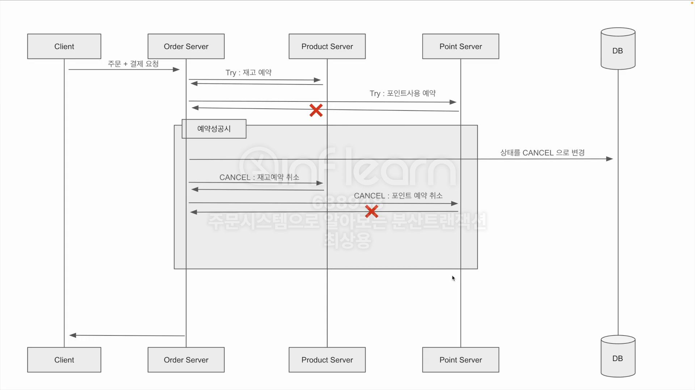

- 예약 도중에 실패하여 주문 상태는 Cancel 로 남아있지만 실제로는 일부 자원이 취소되지 않은 경우

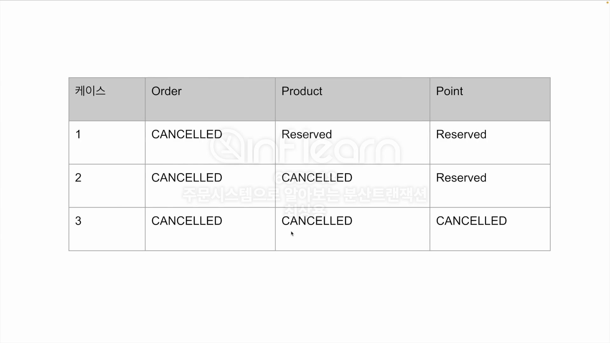

- 세번째는 우리가 의도한 정상적인 상황

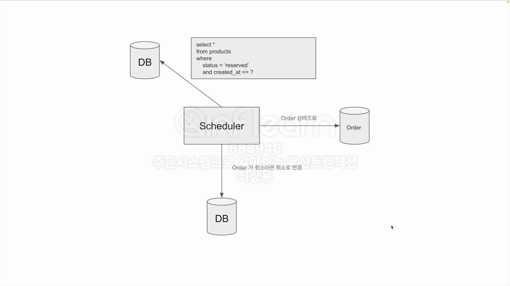

- 이 문제를 해결하기 위한 전략은 각 참여자가 스스로 자원의 상태를 점검하고 정리하는 것
- 프로덕트와 포인트 섭시ㅡ는 자신이 보유하고 있는 데이터를 기준으로 예약된 지 일정 시간이 경과했는데도 아직 상태가 예약인 자원을 주기적으로 탐색
- 만약 그런 자원이 발견되면 각 서비스는 order 서비스의 현재 주문 상태를 조회. 그리고 만약 주문의 상태가 취소인 경우에는 참여자는 스스로 취소 처리를 진행

## 27. Saga란 무엇인가 ?

- 분산 시스템에서 데이터 정합성을 보장하기 위해 사용하는 분산 트랜잭션 처리 방식
- 각  작업을 개별 트랜잭션으로 나누고 실패시에 보상트랜잭션을 수행하여 정합성을 맞추는 방식
  - 보상트랜잭션 로직은 멱등성이어야하며 재시도 가능해야 함
- TCC와 달리 Saga는 리소스 예약없이 즉시 상태 변경을 수행
  - 재고차감 예약이 아닌 즉시 차감
  - 최종적 일관성(Eventual Consistency)을 보장
- Choreography 방식과 Ochestration 방식이 존재

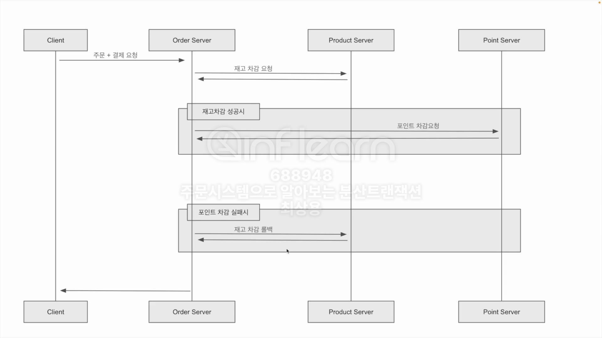

## 28. Saga - Orchestration 방식이란 ?

- Coordinator(또는 Orchestrator)가 각 참여 서비스들을 순차적으로 호출하며 전체 트랜잭션의 흐름을 제어하는 방식

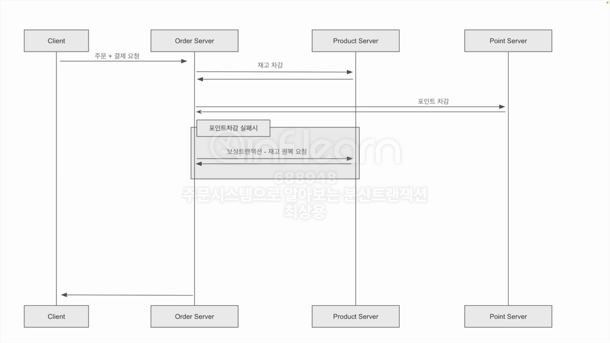

장점

- 구현 난이도와 유지보수 난이도가 낮음
  - 코디네이터를 보면 전체적인 흐름을 파악할 수 있기 때문에 로직을 이해하기 쉬움

단점

- 시간이 지날수록 코디네이터가 복잡해질 수 있음
- 서비스 간 결합도가 증가

## 33. Orchestration - Order 생성 API 구현

## 35. Orchestration - 주문 API 구현

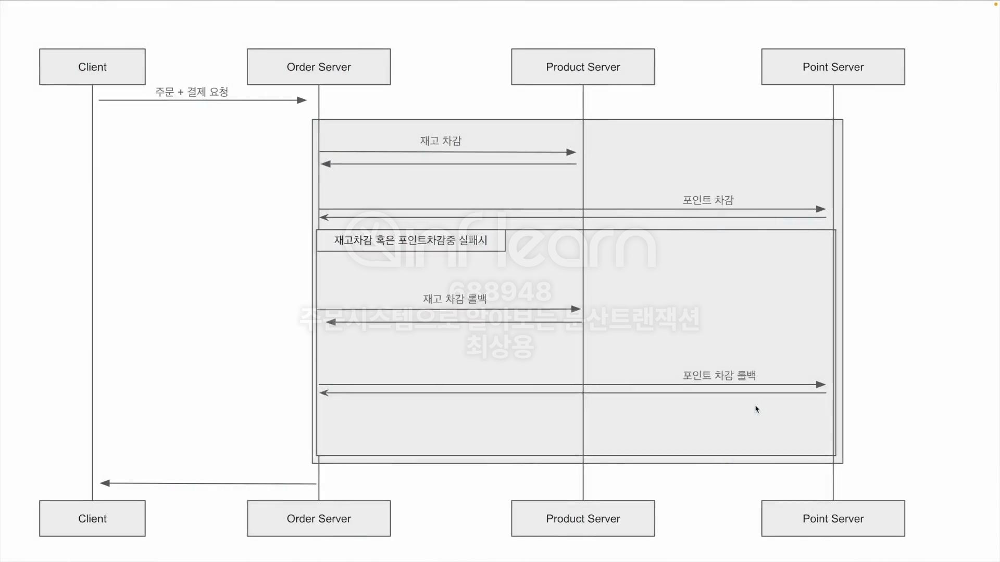

## 37. Orchestration - 현재구조의 문제점과 해결방법

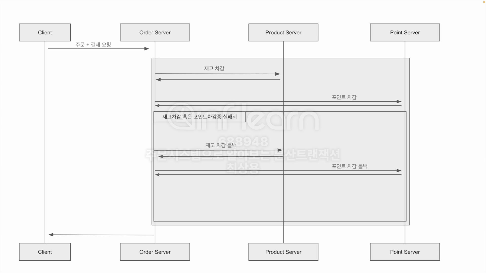

- 롤백 도중에 에러가 발생하는 경우가 고려되지 않았음
- 롤백 도중에 에러가 발생하였을 때의 데이터를 기록해서 추후에 재시도할 수 있도록 해야함

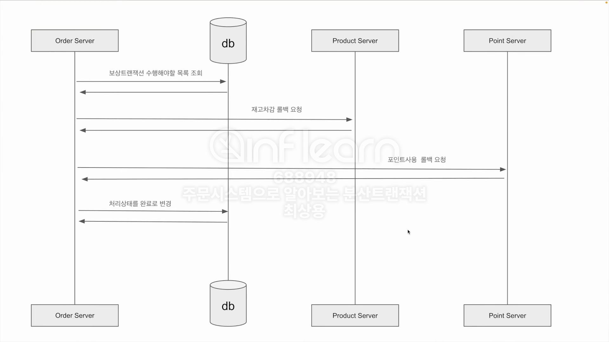

- 주기적인 배치 프로그램이나 스케줄러를 활용해서 '보상트랜잭션 수행해야할 목록(CompensationRegistry status = PENDING) 조회'

## 38. SAGA - Choreography 방식이란 ?

- Coordinator 없이 각 서비스가 이벤트를 발행, 구독하며 이를 통해 전체 트랜잭션을 제어하는 방식

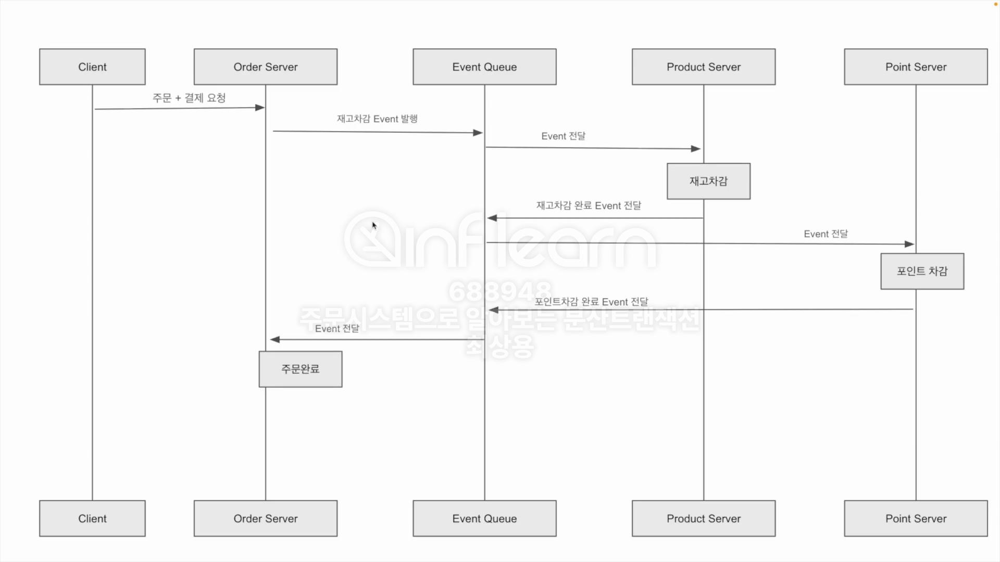

- API호출이 아니라 이벤트 발행

장점

- 이벤트 기반으로 동작을 하다보니 서비스간 결합도가 낮음

단점

- 구현 난이도 상승
- 흐름 파악이 어려움
  - 코디네이터가 없다보니 한눈에 파악하기 어려움

## 44. Choreography - Order 상태조회 API 구현

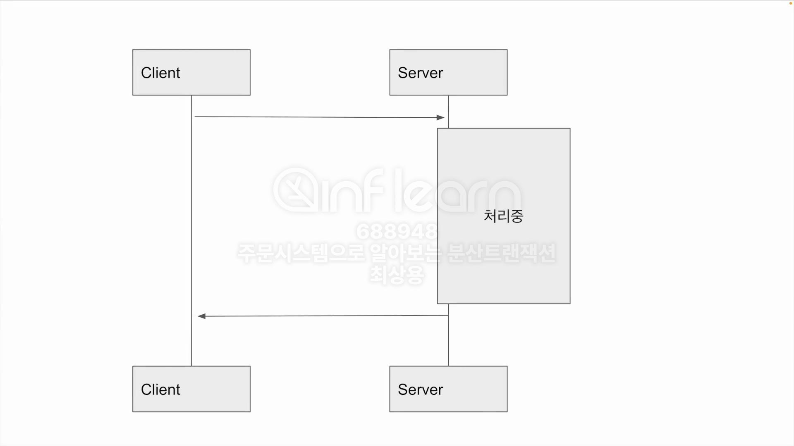

> TCC와 사가 오케스트레이션 방식은 동기식이었기 때문에 클라이언트가 요청을 보내면 서버에서 처리를 진행하고 처리가 모두 완료된 이후에 클라이언트의 응답을 반환하였음

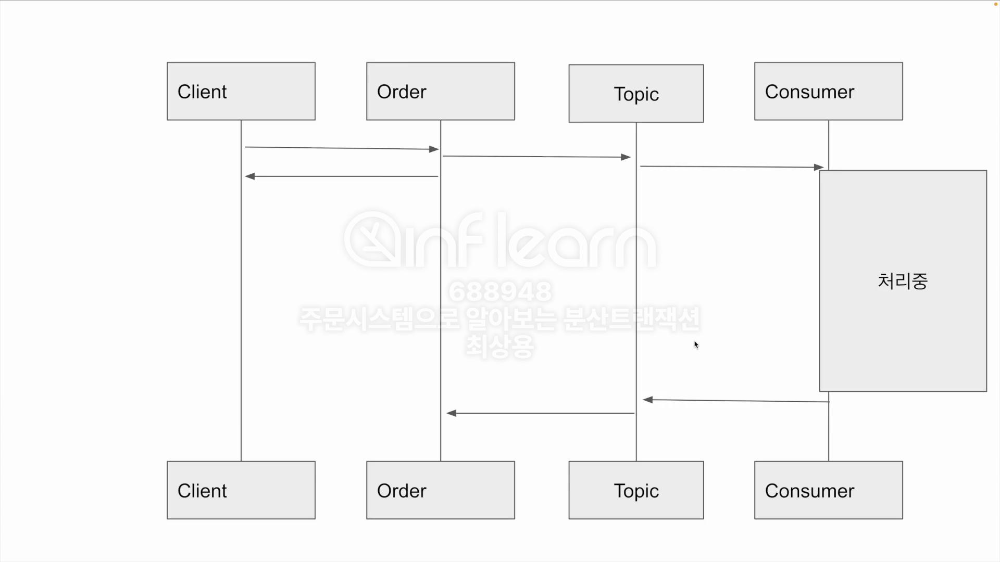

- 반면 코레오그래피 방식은 이벤트 기반 방식으로 비동기로 동작
- 사용자는 요청 이후에 응답을 받았더라도 처리가 완료되지 않았을 수 있음
- 이런 문제를 해결하기 위해서 상태를 알 수 있는 폴링 API를 제공해서 클라이언트에서 상태를 알 수 있도록 해야 함

## 46. 실무에서는 많이 사용하는것은 무엇인가요 ?

2PC

- Two-Phase Commit Protocol 의 약자로 분산 시스템에서 트랜잭션의 원자성을 보장하기 위해 사용하는 프로토콜
- Prepare 단계, Commit 단계 트랜잭션을 두단계로 나누어 처리함
- 실용성이 낮기 때문에 MSA 환경에서는 거의 사용되지 않습니다.

TCC

- TCC(Try-Confirm-Cancel)는 분산 시스템에서 데이터 정합성을 보장하기 위해 사용하는 분산 트랜잭션 처리 방식
- Try, Confirm, Cancel 세 단계로 나누어 트랜잭션을 관리
- 강한 정합성이 필요한 영역에서 제한적으로 사용되며 일반적인 서비스에서는 사용빈도가 낮음

Saga

- 분산 시스템에서 데이터 정합성을 보장하기 위해 사용하는 분산 트랜잭션 처리 방식
- 각 작업을 개별 트랜잭션으로 나누고 실패시에 **보상트랜잭션**을 수행하여 정합성을 맞추는 방식
- TCC와 달리 Saga는 리소스 예약 없이 **즉시 상태 변경**을 수행
  - 재고차감 예약이 아닌 **즉시 차감**
  - **최종적 일관성**(Eventual Consistency)을 보장

Saga - Orchestration

- Coordinator(또는 Orchestrator)가 각 참여 서비스들을 순차적으로 호출하며 전체 트랜잭션의 흐름을 제어하는 방식
- 흐름 파악이 용이하다는 장점이 존재하기 때문에 **실무에서 많이 사용되는 방식**

Saga - Choreography

- Coordinator 없이 각 서비스가 이벤트를 발행, 구독하며 이를 통해 전체 트랜잭션의 흐름을 제어하는 방식
- 흐름파악이 어렵다는 단점이 존재하며 **로직의 처리 시간이 길어질 수 있는 상황일 때 많이 사용됨**
